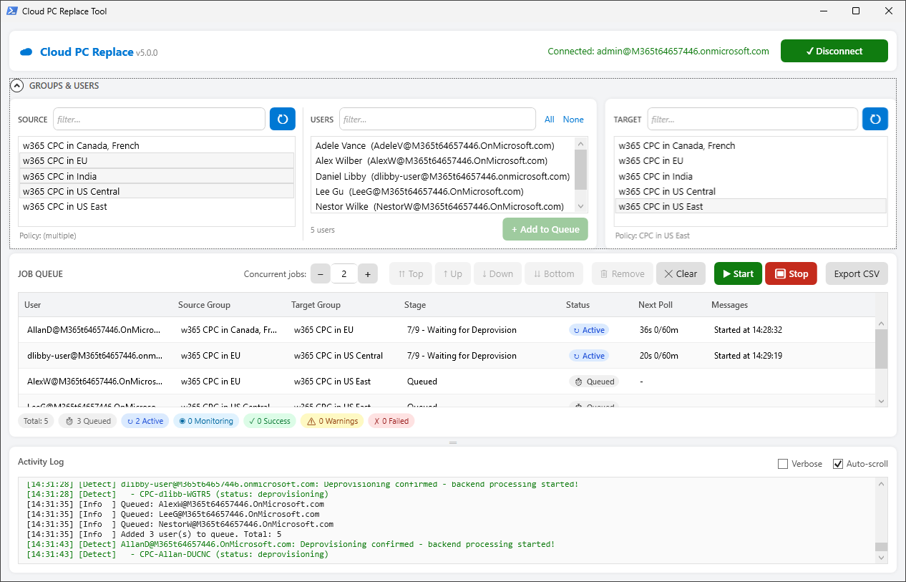

# Cloud PC Replace Tool

A PowerShell GUI tool that automates replacing Windows 365 Cloud PCs using different provisioning profiles.

> ⚠️ **Community Tool** - This is an unsupported side project. Use at your own risk and test thoroughly before production use.

<a href="img/screenshot.png"></a>

*Real-time monitoring with status grid, queue management, and verbose logging*

## Problem Statement

This tool automates replacing a user's Cloud PC from one provisioning profile to another by managing Microsoft Entra ID group memberships.

Organizations may need to replace their users' Enterprise Cloud PCs to use a different provisioning policy but face various challenges:
- Windows 365 Enterprise licenses only support one provisioning policy at a time — you can't run two Enterprise Cloud PCs from different provisioning policies side by side (although you can have multiple different sized Cloud PCs from the same policy)
- Manual process requires admin babysitting through multiple stages (demands attention)
- Need to wait for grace periods and provisioning to complete (time consuming)
- Risk of errors during manual group membership changes (tedious!)

This tool automates the entire replacement workflow:
1. Removes user from source group (current provisioning profile)
2. Monitors Cloud PC until it enters grace period
3. Ends grace period to free the license
4. Adds user to target group (new provisioning profile)
5. Monitors new Cloud PC provisioning
6. Provides real-time progress tracking and error logging

> ⚠️ **IMPORTANT:** This tool **reuses the same Windows 365 license**. The new Cloud PC will have the same size/SKU as the old one. This tool changes the provisioning profile (join type, network, region, image), not the license or size.

## Common Use Cases

This tool can be used to deprovision an existing Enterprise Cloud PC and then provision a new Enterprise Cloud PC **using the same Windows 365 license** with a different Provisioning Profile. Some working examples include:

- **Join Type Changes**: Hybrid Joined ↔ Entra Joined
- **Network Configuration**: Different Azure Virtual Network or Microsoft Hosted Network
- **Geographic Region**: Provision in a different data center/region
- **Image/Applications**: Different base image or app set

> ⚠️ **IMPORTANT:** This tool **will destroy the user's existing Cloud PC** that was provisioned using the Policy assigned to the selected Source group. It then **creates a new Cloud PC** using the Policy assigned to the selected Target group. It does not migrate anything between the Cloud PCs! Be certain you no longer need anything from the Source CPC before you replace it as the entire machine will be deleted and data recovery will not be possible once the Grace period is ended.

## Features

### Current Version (v4.2)

- ✅ **Pre-flight Validation** - Detects AD-synced groups and blocks selection with helpful error
- ✅ **Queue Management** - Add multiple jobs from different source/target groups
- ✅ **Dynamic Concurrency** - Adjust concurrent jobs in real-time (1-40, default 2)
- ✅ **Job Exports** - Auto-save daily CSV + manual export on-demand
- ✅ **Verbose Logging** - Toggle detailed debug logs with checkbox
- ✅ **Timestamped Logs** - All events logged with [HH:mm:ss] format
- ✅ **Queue Reordering** - Move jobs up/down, to top/bottom
- ✅ **Independent Jobs** - Each job has its own source/target groups
- ✅ **Real-Time Messages** - Timeline tracking with warnings and completion time
- ✅ **Status Monitoring** - Active/Monitoring/Queued/Success/Failed states
- ✅ **Three-Panel Layout** - Source, Target, and Users panels
- ✅ **Live User Search** - Filter users as you type
- ✅ **Color-Coded Grid** - Visual status indicators
- ✅ **API Resilience** - Handles status flip-flops and API lag
- ✅ **Optimized Polling** - 3min monitoring, 1min active stages
- ✅ **Large Group Support** - Handles 800+ users with pagination
- ✅ **Multiple CPC Handling** - Detects and manages users with multiple Cloud PCs
- ✅ **Parallel Processing** - Process multiple users simultaneously
- ✅ **Comprehensive Logging** - Timestamped, color-coded logs

## Prerequisites

### Required Software
- **Windows PowerShell 5.1** or later (comes with Windows 10/11)
- **Microsoft Graph PowerShell SDK**

### Required Permissions
Your account needs the following Microsoft Graph API permissions:
- `CloudPC.ReadWrite.All` - Manage Cloud PCs
- `Group.ReadWrite.All` - Modify group memberships  
- `User.Read.All` - Read user information

These permissions can be granted through:
- **Delegated permissions** (user signs in) - Recommended for interactive use
- **Application permissions** (app-only) - For automation scenarios

### Microsoft Entra ID Setup

Two Microsoft Entra ID groups configured for Cloud PC provisioning:
- **Source Group** - Assigned to current provisioning policy
- **Target Group** - Assigned to new/different provisioning policy

> ⚠️ **IMPORTANT:** Groups **MUST be Entra Cloud Groups** (created in Microsoft Entra ID / Azure AD). 
> 
> ❌ **This tool CANNOT work with Active Directory synced groups** - Group memberships cannot be modified via Graph API for AD-synced groups. The script will fail when trying to add/remove users.
> 
> ✅ **Use Cloud-only groups** - Groups where Microsoft Entra ID is the source of authority and members can be changed using Microsoft Graph.

The GUI will let you search for groups by name - no need to look up Object IDs!

> **Examples:**
> - Source: "CPC-HybridJoined" → Target: "CPC-EntraJoined" (Change join type)
> - Source: "CPC-EastUS" → Target: "CPC-WestUS" (Change region/network)
> - Source: "CPC-StandardApps" → Target: "CPC-DeveloperApps" (Change image/apps)


## Installation

### 1. Clone or Download Repository
```powershell
cd C:\projects
git clone https://github.com/yourusername/CloudPC-Replace.git
cd CloudPC-Replace
```

### 2. Install Microsoft Graph PowerShell SDK
```powershell
Install-Module Microsoft.Graph -Scope CurrentUser -Force
```

> **Note:** The GUI will prompt to install the module automatically if not found.

## Usage

### Starting the Application

```powershell
.\Start-CloudPCReplaceGUI.ps1
```

### Step-by-Step Workflow

#### 1. Connect to Microsoft Graph
- Click **Connect to Graph**
- Sign in with your admin credentials
- Grant consent for required permissions
- Button turns green when connected

#### 2. Select Source Group (Current Provisioning Profile)
- In the **Source Group** section, enter a group name to search (e.g., "Hybrid", "EastUS")
- Click **Search** to find matching groups
- Select the group from the results list
- This is the group with the **current** provisioning policy you want to replace FROM

#### 3. Select Target Group (New Provisioning Profile)
- In the **Target Group** section (below Source), enter a group name to search
- Click **Search** and select the desired group
- This is the group with the **new** provisioning policy you want to replace TO

#### 4. Select Users to Replace
- Users from the selected source group automatically load in the **Users** panel (right side)
- Use the search box to filter users by name or UPN
- Click **Select All** or **Select None** links for bulk operations
- Check the boxes next to specific users you want to replace
- Selected count displays at the top

#### 5. Add to Queue
- Click **Add to Queue** to add selected users as jobs
- Each job is independent with its own source/target groups
- You can add more jobs from different source/target combinations
- View all queued jobs in the **Replace Status** grid at the bottom

#### 6. Manage the Queue (Optional)
- **Select a job** in the grid to enable queue management buttons
- **Move Up/Down** - Adjust priority one position at a time
- **Move to Top/Bottom** - Jump to highest/lowest priority
- **Remove Selected** - Remove a job from the queue
- **Clear Queue** - Remove all queued jobs (confirmation required)

#### 7. Configure Concurrency
- Set **Max Concurrent** (1-40, default 2) to control how many jobs run in parallel
- Start with lower values (2-5) to observe behavior and monitor API performance
- Increase as comfortable based on:
  - Your API throttling tolerance
  - How many jobs you want to monitor simultaneously
  - The size of your deployment
- Can be changed dynamically while processing:
  - Increase to process faster (new jobs start when active < max)
  - Decrease to throttle (running jobs continue, new jobs wait)

#### 8. Start Processing
- Click **Start Processing** to begin the replace operations
- Jobs process in queue order (top to bottom)
- **Status indicators:**
  - Gray = Queued (waiting to start)
  - Blue = Active (doing admin work - counts against concurrency)
  - Cyan = Monitoring (passive provisioning - doesn't block other jobs)
  - Green = Success
  - Yellow = Success (Warnings) - completed with non-blocking warnings
  - Red = Failed

#### 9. Monitor Progress
- **Stage column** shows current step (1/9 through 9/9):
  1. Getting User Info
  2. Getting Current Cloud PC
  3. Removing from Source Group
  4. Waiting for Grace Period
  5. Ending Grace Period
  6. Waiting for Deprovision
  7. Adding to Target Group
  8. Waiting for Provisioning (Monitoring)
  9. Complete
- **Status column** shows job state:
  - Queued - waiting to start
  - Active - doing admin work
  - Monitoring - waiting for provisioning
  - Success - completed successfully
  - Success (Warnings) - completed with warnings
  - Failed - operation failed
- **Messages column** shows timeline and warnings:
  - "Started at HH:MM:SS"
  - "Multiple CPCs detected (2)" - warning
  - "Status flip-flop detected (API lag)" - informational
  - "Waiting for new CPC to provision..."
  - "Completed in 15 minutes"
- **Progress bar** shows overall stats
- **Next Poll column** shows countdown for waiting stages

#### 10. Add or Remove Jobs While Running
- You can modify the queue while processing
- Add new jobs: Select different source/target groups and add more users
- Remove queued jobs: Select and remove jobs that haven't started yet
- They'll start when concurrency slots are available

#### 11. Stop Processing (Optional)
- Click **Stop Processing** to halt the queue
- Currently active jobs will complete fully (all stages to Success/Failed)
- No new jobs will start from the queue
- Click **Start Processing** again to resume queued jobs

#### 12. Review Results
- Jobs show final status:
  - Success - Cloud PC replaced successfully
  - Success (Warnings) - Cloud PC replaced but provisioned with warnings
  - Failed - replacement operation failed
- Messages column shows completion time or error details
- Click **Export Summary** to save a CSV report with all job details
- Full logs automatically saved to: `CloudPCReplace_Logs\` folder (same location as script)
- Review any failed replacements and retry individually by re-adding them

## Troubleshooting

### "Failed to connect to Microsoft Graph"
- Ensure you have internet connectivity
- Verify you're signing in with an admin account
- Check that your account has the required permissions

### "No groups found"
- Verify you have the correct group name
- Try searching with a partial name (e.g., "Cloud" instead of "Cloud PC Provisioning")
- Check that you have permissions to read groups

### "No users found in group"
- The group may be empty
- The group may only contain devices or other groups (not users)
- Users may have been removed since the last sync

### "Error adding/removing user from group" or "Insufficient privileges"
- **Most Common:** The group is synced from Active Directory (AD-synced groups cannot be modified via Graph API)
  - ✅ **Solution:** Use Entra Cloud Groups (created in Microsoft Entra ID) instead
  - Check group source: Azure Portal → Microsoft Entra ID → Groups → [Your Group] → Properties → "Sync Type" should be "Cloud"
- The account running the tool doesn't have `Group.ReadWrite.All` permission
- The group may be a special system group that cannot be modified

### "Status flip-flop detected (API lag)"
- This is informational, not an error
- Microsoft Graph API sometimes reports stale status during deprovision
- The tool handles this automatically and continues
- The job will complete successfully

### "Multiple CPCs detected (X)"
- User has more than one Cloud PC (multiple licenses for the same policy)
- This is a warning - the tool will track all CPCs
- All CPCs from the source group will be deprovisioned
- New CPCs from the target group will provision for each licnese 

### "Timeout waiting for grace period"
- The Cloud PC may already be deprovisioned
- Check Cloud PC status in Windows 365 portal
- Consider increasing `GracePeriodTimeoutMinutes` from default

### "Timeout waiting for provisioning"
- Provisioning can take 30-60 minutes and can vary
- Check Windows 365 portal for provisioning errors
- Verify the provisioning policy is correctly configured
- Consider increasing `ProvisioningTimeoutMinutes` from default

### Jobs not starting when queue has room
- Check **Max Concurrent** setting - may be too low
- Verify jobs are in "Queued" status (gray) not already "InProgress"
- Click **Start Processing** if you've stopped the queue

## Advanced Usage

<details>
<summary>View PowerShell module usage examples</summary>

### Using the PowerShell Module Directly

The GUI is the recommended way to use this tool. However, if you need programmatic access, you can use the module functions directly:

```powershell
# Import the module
Import-Module .\CloudPCReplace.psm1

# Connect to Graph
Connect-MgGraphForReplace -TenantId "your-tenant-id"

# Initialize logging
Initialize-Logging

# Replace a single user's Cloud PC
$result = Start-CloudPCReplace `
    -UserPrincipalName "user@contoso.com" `
    -SourceGroupId "source-group-object-id" `
    -TargetGroupId "target-group-object-id" `
    -PollingIntervalSeconds 60 `
    -GracePeriodTimeoutMinutes 15 `
    -ProvisioningTimeoutMinutes 90

# Note: GUI has more granular timeouts (Grace 15m, Ending Grace 30m, Deprovision 60m, Provisioning 90m)

# Check result
if ($result.Status -eq 'Success') {
    Write-Host "Replace successful!"
} else {
    Write-Host "Replace failed: $($result.ErrorMessage)"
}
```

> **Note:** The GUI handles all configuration through its interface - no config files needed.

</details>

## Architecture

<details>
<summary>View technical architecture and workflow details</summary>

### Components

1. **CloudPCReplace.psm1** - Core PowerShell module
   - Graph API authentication
   - Cloud PC operations (get status, end grace period)
   - Group membership management
   - Replace workflow state machine
   - Logging and error handling

2. **Start-CloudPCReplaceGUI.ps1** - Windows Forms GUI
   - User interface
   - Configuration management
   - Progress tracking
   - Real-time log display

### Replace Workflow (9 Stages)

```
┌─────────────────────────────────────────────────────────────┐
│ Stage 1/9: Getting User Info                                │
│ - Validates user exists in Microsoft Entra ID               │
│ - Retrieves user ID and details                             │
└────────────────────┬────────────────────────────────────────┘
                     │
                     ▼
┌─────────────────────────────────────────────────────────────┐
│ Stage 2/9: Getting Current Cloud PC                         │
│ - Retrieves existing Cloud PC(s) for user                   │
│ - Matches against source group's provisioning policies      │
│ - Warns if multiple CPCs detected                           │
└────────────────────┬────────────────────────────────────────┘
                     │
                     ▼
┌─────────────────────────────────────────────────────────────┐
│ Stage 3/9: Removing from Source Group                       │
│ - Removes user from source group                            │
│ - Triggers Cloud PC to enter grace period                   │
└────────────────────┬────────────────────────────────────────┘
                     │
                     ▼
┌─────────────────────────────────────────────────────────────┐
│ Stage 4/9: Waiting for Grace Period                         │
│ - Polls every 60s until CPC status = 'inGracePeriod'        │
│ - Timeout: 15 minutes                                       │
│ - Handles status flip-flops gracefully                      │
└────────────────────┬────────────────────────────────────────┘
                     │
                     ▼
┌─────────────────────────────────────────────────────────────┐
│ Stage 5/9: Ending Grace Period                              │
│ - Calls Stop-CloudPCGracePeriod API                         │
│ - Initiates immediate deprovision to free license           │
│ - Timeout: 30 minutes                                       │
└────────────────────┬────────────────────────────────────────┘
                     │
                     ▼
┌─────────────────────────────────────────────────────────────┐
│ Stage 6/9: Waiting for Deprovision                          │
│ - Polls every 60s until all tracked CPCs are gone           │
│ - Timeout: 60 minutes                                       │
│ - Handles API lag and status inconsistencies                │
│ - License freed when complete                               │
└────────────────────┬────────────────────────────────────────┘
                     │
                     ▼
┌─────────────────────────────────────────────────────────────┐
│ Stage 7/9: Adding to Target Group                           │
│ - Adds user to target group                                 │
│ - Triggers new Cloud PC provisioning                        │
└────────────────────┬────────────────────────────────────────┘
                     │
                     ▼
┌─────────────────────────────────────────────────────────────┐
│ Stage 8/9: Waiting for Provisioning (Monitoring)            │
│ - Polls every 180s (3 min) for new CPC status               │
│ - Status: "Monitoring" (doesn't block other jobs)           │
│ - Timeout: 90 minutes (warns instead of fails)              │
│ - Admin work complete - passive monitoring only             │
└────────────────────┬────────────────────────────────────────┘
                     │
                     ▼
┌─────────────────────────────────────────────────────────────┐
│ Stage 9/9: Complete                                         │
│ - New Cloud PC provisioned and ready                        │
│ - Shows completion time in Messages                         │
└─────────────────────────────────────────────────────────────┘
```

**Key Concepts:**
- **Active Jobs** (Stages 1-7): Require admin API calls, count against concurrency limit
- **Monitoring Jobs** (Stages 8-9): Passive polling only, do NOT count against limit
- This design allows 10x faster throughput for large batches

</details>

## Security Considerations

- **Credentials are not stored** - uses interactive authentication
- **Logs may contain sensitive data** - secure the log directory
- **Use least privilege** - only grant necessary Graph permissions
- **Review changes** - test with a few users before bulk operations

## License

MIT License - See [LICENSE](LICENSE) file for details

## Support

**This is an unsupported community tool.** There is no official support, SLA, or guarantee of responses.

If you encounter issues:
- Review the **Troubleshooting** section above
- Check the logs in `CloudPCReplace_Logs\` folder (same location as script)
- Read through the PowerShell script - it's well-commented
- Use GitHub Copilot or similar AI tools to help understand the code
- Open a GitHub issue to share findings with the community (no promises on fixes)

This tool is provided as-is. Use at your own risk.

## Version History

### v4.2 (2026-02-18)

**Added**
- Pre-flight group validation (detects AD-synced groups, shows *!AD-Synced!* warning tag)
- Group selection blocking (prevents selection of AD-synced groups with helpful error dialog)
- Enhanced error messaging (links to troubleshooting documentation with remediation steps)

**Changed**
- Group API query now includes `onPremisesSyncEnabled` property for validation
- Group listbox display includes visual warning for AD-synced groups
- Updated documentation with clearer group requirements and validation behavior

### v4.1 (2026-02-18)

**Added**
- Job summary exports (auto-save daily CSV to script folder, manual Export button with custom filename)
- Verbose logging toggle (checkbox to show/hide detailed debug logs in real-time)
- Complete timestamp standardization (all logs now use consistent yyyy-MM-dd HH:mm:ss format)
- Centralized version number (single source in script, displayed in window title)
- provisionedWithWarnings detection (shows yellow "Success (Warnings)" status for non-critical provisioning issues)
- Service plan matching for multi-license users (completion detection now groups by service plan type)
- Username prefixes on all user-context log messages (easier to track concurrent jobs)
- Complete log file capture (all messages written to file regardless of verbose setting)
- Stage-specific timeouts with visual indicators (Next Poll column shows stage timeout)

**Fixed**
- **CRITICAL**: Deprovision skip bug (if user already in grace, job would skip deprovisioning entirely)
- **CRITICAL**: Queue reorder bug (Move Up/Down buttons cleared entire queue instead of reordering)
- **CRITICAL**: Export CSV NewCPC column (users with multiple CPCs showed same NewCPC name for all jobs)
- **CRITICAL**: Multi-license completion detection (users with multiple different-size CPCs never completed)
- **CRITICAL**: Queue re-use after completion (couldn't add new jobs after all jobs finished)
- **CRITICAL**: Log file writing (GUI logging functions weren't writing to file)
- Queue reorder display (Status showed "InProgress" instead of "Active/Monitoring", Messages lost "Started at" timestamp)
- Completion check (jobs with "Success (Warnings)" status weren't counted as complete)
- Clear queue button (index out of range error when clearing)
- Grace period false warnings (removed 5-minute minimum check)
- NextPoll column (smoothed countdown display to avoid flickering)
- Button layout (overlapping borders, inconsistent heights and spacing)
- State change child message tags (indented detail lines now match parent tag)

**Changed**
- Timeout adjustments (grace period 15 min, ending grace 30 min, deprovision 60 min, provisioning 90 min based on real-world testing)
- Provisioning completion logic (now matches old/new CPCs by service plan name for accurate pairing)
- CSV export logic (matches CPCs by service plan, one row per old CPC with corresponding new CPC)
- Log file behavior (verbose checkbox controls console only, file always captures everything)
- Provisioning timeout behavior (now shows yellow warning instead of red failure, job continues)
- Pagination support (handles tenants with 800+ groups via @odata.nextLink)
- Case-insensitive sorting (group lists alphabetized regardless of case)
- Multiple CPC messages (changed from yellow warning to cyan info level)
- Concurrency limits (max increased from 10 to 40, default changed from 1 to 2)
- Logging standardization (all 138 logging commands audited for consistency and accuracy)
- Documentation improvements (workflow accuracy, consolidated redundant steps, added 9-stage descriptions)

### v4.0 (2026-02-13)

**Added**
- Queue system with independent jobs
- Dynamic concurrency control
- Queue management (reorder, remove)
- Three-panel layout
- Live user search
- Grid selection
- Add jobs while processing

**Changed**
- Smart monitoring (non-blocking provisioning)
- Status flip-flop handling
- Multiple CPC detection

### Earlier Development Iterations

**v3.0** - Parallel processing, status grid, configurable concurrency  
**v2.0** - Group search, user selection, checkbox UI  
**v1.0** - First draft with basic GUI, manual group entry, CSV import
